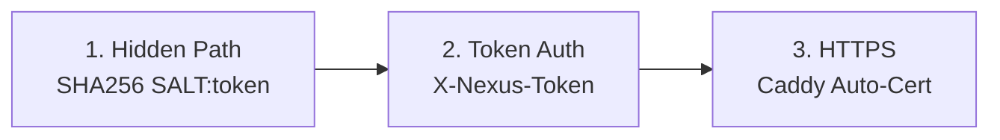

<div align="center">

# 🌐 NexusProxy

**Distributed Proxy Cluster Management System**

[](LICENSE)
[](https://www.docker.com/)
[](https://www.python.org/)
[](CONTRIBUTING.md)

[English](README.md) | [简体中文](README_CN.md)

</div>

---

## 🚀 Quick Start

### Prerequisites

- Docker 20.10+ with Docker Compose
- Domain name (for Node HTTPS)
- Ports: 80, 443, 53 (Node only)

### Install Master

```bash
git clone https://github.com/yourusername/nexus-proxy.git
cd nexus-proxy
sudo ./install.sh --master
```

> 📝 **Save the Cluster Secret** displayed after installation!

### Install Node

```bash
sudo ./install.sh --node
# Enter: Cluster Secret, Node Domain, Email
```

### Add Node to Master

1. Open `http://MASTER_IP:5000`
2. Click **"+ Add Node"**
3. Enter node name and domain

---

## ✨ Features

- 🔐 **Secure** - Salted hash path + Token auth + HTTPS
- 🚀 **One-Click** - Interactive installer with auto Docker setup
- 🎛️ **Centralized** - Web UI to manage all nodes
- 📦 **Batteries Included** - Sing-box, AdGuard Home, Caddy pre-configured

---

## 🏗️ Architecture

```
┌──────────────────────────────────────────────────────────────┐
│                         MASTER                                │
│              Web UI (Flask) - Port 5000                       │
└──────────────────────────────────────────────────────────────┘
                              │
                    CLUSTER_SECRET + SALT
                              │
        ┌─────────────────────┼─────────────────────┐
        ▼                     ▼                     ▼
┌───────────────┐     ┌───────────────┐     ┌───────────────┐
│    NODE 1     │     │    NODE 2     │     │    NODE N     │
│ Caddy→Agent   │     │ Caddy→Agent   │     │ Caddy→Agent   │
│ Sing-box      │     │ Sing-box      │     │ Sing-box      │
│ AdGuard Home  │     │ AdGuard Home  │     │ AdGuard Home  │
└───────────────┘     └───────────────┘     └───────────────┘
```

---

## 🔒 Security Model

### Salted Hidden Path Generation

```python
SALT = "NexusProxy_Secured_2024"

def get_hidden_path(token: str) -> str:
    combined = f"{SALT}:{token}"
    hash_val = hashlib.sha256(combined.encode()).hexdigest()
    return hash_val[:16]  # e.g., "a1b2c3d4e5f67890"

# Final API: /{hash}/api/v1/status
```

### Three-Layer Protection



**Why this design?**
- **Deterministic**: Same token = same path on Master & Node
- **Anti-Scanning**: Without token, path is unpredictable
- **Defense in Depth**: Caddy only routes hidden path, others get camouflage page

---

## 📁 Project Structure

```
nexus-proxy/
├── install.sh           # Interactive installer
├── README.md / README_CN.md
├── LICENSE / .gitignore
├── master/
│   ├── docker-compose.yml
│   ├── Dockerfile
│   ├── app.py           # Flask + get_hidden_path()
│   └── templates/index.html
└── node/
    ├── docker-compose.yml
    ├── Dockerfile
    ├── agent.py          # Flask + get_hidden_path()
    └── templates/Caddyfile.template
```

---

## 📡 API Reference

### Node Endpoints

> Path: `/{PATH_PREFIX}/api/v1/...`  
> Header: `X-Nexus-Token: <CLUSTER_SECRET>`

| Endpoint | Method | Description |
|----------|--------|-------------|
| `/status` | GET | Node health |
| `/services` | GET | All services status |
| `/restart/<service>` | POST | Restart service |
| `/config/<service>` | GET/POST | Get/Update config |
| `/logs/<service>` | GET | Service logs |

---

## 🔧 Troubleshooting

| Issue | Solution |
|-------|----------|
| Port in use | `sudo lsof -i :80` then stop conflicting service |
| Token error | Verify secret in `/opt/nexus-proxy/node/.env` |
| SSL error | Check DNS points to node IP, port 80 accessible |
| Node offline | Run `sudo ./install.sh --status` |

---

## ⚠️ Disclaimer

This project is for **educational and technical research purposes only**. Users must comply with local laws and regulations. The authors are not responsible for any misuse.

---

## 📄 License

MIT License - see [LICENSE](LICENSE)

---

<div align="center">
Made with ❤️ for the open source community
</div>
