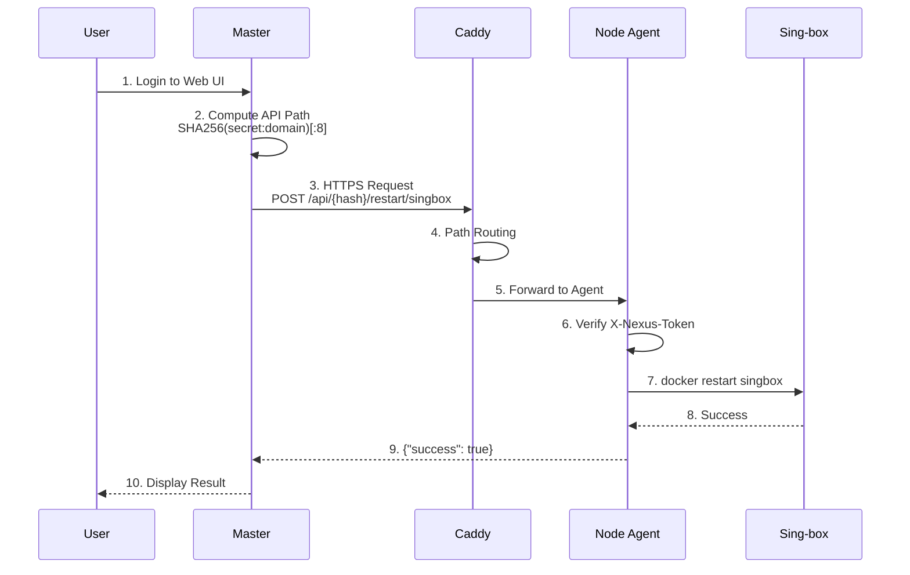
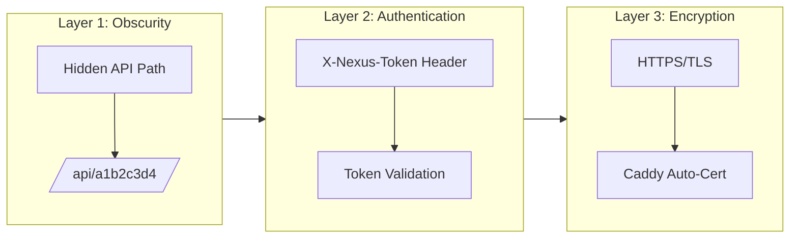

<div align="center">

# 🌐 NexusProxy

**Distributed Proxy Cluster Management System**

一键部署和管理 Sing-box + AdGuard Home 节点的分布式代理集群系统

[](https://opensource.org/licenses/MIT)
[](https://www.docker.com/)
[](https://www.python.org/)
[](CONTRIBUTING.md)
[](https://github.com/yourusername/nexus-proxy)

[English](README.md) | [简体中文](README_CN.md)


</div>

---

## 📋 Table of Contents

- [Features](#-features)
- [Architecture](#-architecture)
- [Security Model](#-security-model)
- [Quick Start](#-quick-start)
- [Configuration](#-configuration)
- [API Reference](#-api-reference)
- [Troubleshooting](#-troubleshooting)
- [Contributing](#-contributing)
- [License](#-license)
- [Disclaimer](#%EF%B8%8F-disclaimer)

---

## ✨ Features

| Feature | Description |
|---------|-------------|
| 🔐 **Secure by Design** | Shared secret + hidden API path + token authentication |
| 🚀 **One-Click Deploy** | Interactive installer with automatic dependency management |
| 🎛️ **Centralized Control** | Web UI to manage all nodes from a single dashboard |
| 📦 **Batteries Included** | Pre-configured Sing-box, AdGuard Home, and Caddy |
| 🔄 **Auto HTTPS** | Caddy automatically provisions and renews SSL certificates |
| 🛡️ **Idempotent Install** | Safe to re-run installer without breaking existing config |
| 📊 **Real-time Status** | Monitor node health and service status in real-time |

---

## 🏗️ Architecture

### System Overview

```
┌─────────────────────────────────────────────────────────────────────┐
│                            MASTER                                    │
│  ┌───────────────────────────────────────────────────────────────┐  │
│  │                     Web UI (Flask)                             │  │
│  │   • Node Management    • Service Control    • Config Editor   │  │
│  └───────────────────────────────────────────────────────────────┘  │
└─────────────────────────────────────────────────────────────────────┘
                                  │
                        CLUSTER_SECRET (SHA-256)
                                  │
          ┌───────────────────────┼───────────────────────┐
          ▼                       ▼                       ▼
┌─────────────────┐     ┌─────────────────┐     ┌─────────────────┐
│     NODE 1      │     │     NODE 2      │     │     NODE N      │
│  ┌───────────┐  │     │  ┌───────────┐  │     │  ┌───────────┐  │
│  │   Caddy   │  │     │  │   Caddy   │  │     │  │   Caddy   │  │
│  │  (HTTPS)  │  │     │  │  (HTTPS)  │  │     │  │  (HTTPS)  │  │
│  └─────┬─────┘  │     │  └─────┬─────┘  │     │  └─────┬─────┘  │
│        │        │     │        │        │     │        │        │
│  ┌─────┴─────┐  │     │  ┌─────┴─────┐  │     │  ┌─────┴─────┐  │
│  │   Agent   │  │     │  │   Agent   │  │     │  │   Agent   │  │
│  │  (Flask)  │  │     │  │  (Flask)  │  │     │  │  (Flask)  │  │
│  └─────┬─────┘  │     │  └─────┬─────┘  │     │  └─────┬─────┘  │
│        │        │     │        │        │     │        │        │
│  ┌─────┴─────┐  │     │  ┌─────┴─────┐  │     │  ┌─────┴─────┐  │
│  │ Sing-box  │  │     │  │ Sing-box  │  │     │  │ Sing-box  │  │
│  │ AdGuard   │  │     │  │ AdGuard   │  │     │  │ AdGuard   │  │
│  └───────────┘  │     │  └───────────┘  │     │  └───────────┘  │
└─────────────────┘     └─────────────────┘     └─────────────────┘
```

### Control Flow (Mermaid)



---

## 🔒 Security Model

### Three-Layer Protection



### API Path Computation

```python
import hashlib

def compute_api_path(secret: str, domain: str) -> str:
    """
    Compute hidden API path based on shared secret and domain.
    
    Example:
        secret = "abc123..."
        domain = "node1.example.com"
        result = "a1b2c3d4"  # First 8 chars of SHA-256
    """
    combined = f"{secret}:{domain}"
    return hashlib.sha256(combined.encode()).hexdigest()[:8]
```

---

## 🚀 Quick Start

### Prerequisites

| Requirement | Minimum Version | Notes |
|-------------|-----------------|-------|
| Docker | 20.10+ | With Docker Compose |
| OS | Ubuntu 20.04+ / Debian 11+ | Or any Linux with Docker |
| Ports | 80, 443, 53 | For Node only |
| Domain | Required for Node | For HTTPS certificates |

### Installation

```bash
# Clone the repository
git clone https://github.com/yourusername/nexus-proxy.git
cd nexus-proxy

# Run interactive installer (requires root)
sudo ./install.sh
```

### Step-by-Step Guide

<details>
<summary><b>Step 1: Install Master</b></summary>

```bash
sudo ./install.sh --master
```

After installation:
- Control Panel: `http://YOUR_IP:5000`
- **Save the Cluster Secret** (displayed after installation)

</details>

<details>
<summary><b>Step 2: Install Node(s)</b></summary>

On each node server:

```bash
sudo ./install.sh --node
```

You'll be prompted for:
1. **Cluster Secret** - From Master installation
2. **Node Domain** - e.g., `node1.example.com`
3. **ACME Email** - For SSL certificates

</details>

<details>
<summary><b>Step 3: Register Node in Master</b></summary>

1. Open Master Control Panel
2. Click **"+ Add Node"**
3. Enter node name and domain
4. Start managing!

</details>

---

## 📁 Project Structure

```
nexus-proxy/
├── install.sh                 # Interactive installer (entry point)
├── README.md                  # This file
├── LICENSE                    # MIT License
├── .gitignore                 # Git ignore rules
│
├── master/                    # Master controller
│   ├── docker-compose.yml     # Docker orchestration
│   ├── Dockerfile             # Container build
│   ├── app.py                 # Flask backend
│   ├── requirements.txt       # Python dependencies
│   └── templates/
│       └── index.html         # Web UI
│
└── node/                      # Node agent
    ├── docker-compose.yml     # Docker orchestration
    ├── Dockerfile             # Container build
    ├── agent.py               # Node control agent
    ├── requirements.txt       # Python dependencies
    └── templates/
        └── Caddyfile.template # Caddy config template
```


---

## ⚙️ Configuration

### Environment Variables

#### Master

| Variable | Description | Default |
|----------|-------------|---------|
| `CLUSTER_SECRET` | Shared authentication secret | Auto-generated |
| `DATA_DIR` | Persistent data directory | `/data` |

#### Node

| Variable | Description | Default |
|----------|-------------|---------|
| `CLUSTER_SECRET` | Shared secret (from Master) | **Required** |
| `NODE_DOMAIN` | Node's public domain | **Required** |
| `ACME_EMAIL` | Email for Let's Encrypt | `admin@example.com` |
| `API_PATH` | Hidden API path segment | Auto-computed |

### Service Configuration

<details>
<summary><b>Sing-box Configuration</b></summary>

Location: `/opt/nexus-proxy/node/config/singbox/config.json`

```json
{
  "log": {
    "level": "info",
    "timestamp": true
  },
  "inbounds": [
    {
      "type": "mixed",
      "tag": "mixed-in",
      "listen": "::",
      "listen_port": 1080
    }
  ],
  "outbounds": [
    {
      "type": "direct",
      "tag": "direct"
    }
  ]
}
```

</details>

<details>
<summary><b>AdGuard Home</b></summary>

- First-time setup: `https://your-node-domain/adguard/`
- DNS Port: 53 (TCP/UDP)
- Config: `/opt/nexus-proxy/node/config/adguard/`

</details>

---

## 📡 API Reference

### Master Endpoints

| Endpoint | Method | Description |
|----------|--------|-------------|
| `/api/nodes` | `GET` | List all registered nodes |
| `/api/nodes` | `POST` | Add a new node |
| `/api/nodes/<id>` | `DELETE` | Remove a node |
| `/api/nodes/<id>/status` | `GET` | Get node status |
| `/api/nodes/<id>/services` | `GET` | Get services status |
| `/api/nodes/<id>/restart/<service>` | `POST` | Restart a service |
| `/api/nodes/<id>/config/<service>` | `GET` | Get service config |
| `/api/nodes/<id>/config/<service>` | `POST` | Update service config |

### Node Endpoints (Hidden Path)

> All endpoints require `X-Nexus-Token: <CLUSTER_SECRET>` header

| Endpoint | Method | Description |
|----------|--------|-------------|
| `/api/<hash>/status` | `GET` | Node health status |
| `/api/<hash>/services` | `GET` | All services status |
| `/api/<hash>/restart/<service>` | `POST` | Restart service |
| `/api/<hash>/config/<service>` | `GET` | Get configuration |
| `/api/<hash>/config/<service>` | `POST` | Update configuration |
| `/api/<hash>/logs/<service>` | `GET` | Get service logs |

### Example API Call

```bash
# Get node status
curl -X GET \
  -H "X-Nexus-Token: YOUR_CLUSTER_SECRET" \
  https://node1.example.com/api/a1b2c3d4/status

# Restart sing-box
curl -X POST \
  -H "X-Nexus-Token: YOUR_CLUSTER_SECRET" \
  https://node1.example.com/api/a1b2c3d4/restart/singbox
```

---

## 🔧 Troubleshooting

### Common Issues

<details>
<summary><b>❌ Port already in use</b></summary>

**Symptom:** Installation fails with "port is already in use"

**Solution:**
```bash
# Find what's using the port
sudo lsof -i :80
sudo lsof -i :443
sudo lsof -i :53

# Stop the conflicting service
sudo systemctl stop nginx    # or apache2, etc.
sudo systemctl stop systemd-resolved  # for port 53
```

</details>

<details>
<summary><b>❌ Token authentication failed</b></summary>

**Symptom:** Master cannot connect to node, shows "Unauthorized"

**Solution:**
1. Verify the Cluster Secret matches on both Master and Node
2. Check the secret in `/opt/nexus-proxy/node/.env`
3. Reinstall node with correct secret:
   ```bash
   sudo ./install.sh --node
   ```

</details>

<details>
<summary><b>❌ SSL certificate not working</b></summary>

**Symptom:** HTTPS shows certificate error

**Solution:**
1. Ensure domain DNS points to node IP
2. Check Caddy logs:
   ```bash
   docker logs nexus-caddy
   ```
3. Verify port 80 is accessible (required for ACME challenge)

</details>

<details>
<summary><b>❌ Node shows offline in Master</b></summary>

**Symptom:** Node added but status shows "offline"

**Solution:**
1. Verify node domain is correct
2. Check if node services are running:
   ```bash
   sudo ./install.sh --status
   ```
3. Test connectivity:
   ```bash
   curl -I https://your-node-domain/health
   ```

</details>

<details>
<summary><b>❌ Docker permission denied</b></summary>

**Symptom:** "permission denied while trying to connect to Docker daemon"

**Solution:**
```bash
# Add user to docker group
sudo usermod -aG docker $USER

# Or run with sudo
sudo ./install.sh
```

</details>

### View Logs

```bash
# Master logs
cd /opt/nexus-proxy/master && docker compose logs -f

# Node logs (all services)
cd /opt/nexus-proxy/node && docker compose logs -f

# Specific service
docker logs -f nexus-singbox
docker logs -f nexus-adguard
docker logs -f nexus-caddy
```

### Reset Installation

```bash
# Complete reset
sudo ./install.sh --uninstall

# Then reinstall
sudo ./install.sh
```

---

## 🤝 Contributing

We welcome contributions! Please see our [Contributing Guide](CONTRIBUTING.md) for details.

### Development Setup

```bash
# Clone repo
git clone https://github.com/yourusername/nexus-proxy.git
cd nexus-proxy

# Create virtual environment
python -m venv venv
source venv/bin/activate

# Install dependencies
pip install -r master/requirements.txt
pip install -r node/requirements.txt

# Run tests
pytest
```

### Contribution Workflow

1. Fork the repository
2. Create a feature branch (`git checkout -b feature/amazing-feature`)
3. Commit your changes (`git commit -m 'Add amazing feature'`)
4. Push to the branch (`git push origin feature/amazing-feature`)
5. Open a Pull Request

---

## 📄 License

This project is licensed under the MIT License - see the [LICENSE](LICENSE) file for details.

---

## ⚠️ Disclaimer

> **IMPORTANT: Please read carefully before using this software.**

1. **Educational Purpose Only**: This project is developed for educational and technical research purposes. Users are responsible for ensuring their use complies with all applicable laws and regulations.

2. **No Warranty**: This software is provided "as is", without warranty of any kind, express or implied. The authors are not responsible for any damages or legal issues arising from the use of this software.

3. **User Responsibility**: Users must ensure they have proper authorization before deploying this system on any network. Unauthorized access to computer systems is illegal.

4. **Network Regulations**: Users must comply with local network regulations and terms of service of their network providers.

5. **Not for Illegal Activities**: This software must not be used for any illegal activities, including but not limited to unauthorized access, data theft, or circumventing security measures.

By using this software, you acknowledge that you have read, understood, and agree to this disclaimer.

---

## 🙏 Acknowledgments

- [Sing-box](https://github.com/SagerNet/sing-box) - Universal proxy platform
- [AdGuard Home](https://github.com/AdguardTeam/AdGuardHome) - Network-wide ad blocking
- [Caddy](https://caddyserver.com/) - Automatic HTTPS web server
- [Flask](https://flask.palletsprojects.com/) - Python web framework

---

<div align="center">

Made with ❤️ for the open source community

**[⬆ Back to Top](#-nexusproxy)**

</div>
