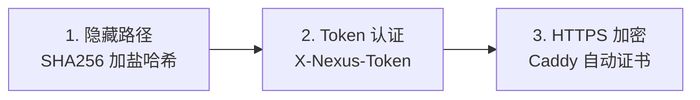

<div align="center">

# 🌐 NexusProxy

**分布式代理集群管理系统**

[](LICENSE)
[](https://www.docker.com/)
[](https://www.python.org/)
[](CONTRIBUTING.md)

[English](README.md) | [简体中文](README_CN.md)

</div>

---

## 🚀 快速开始

### 环境要求

- Docker 20.10+ (含 Docker Compose)
- 域名 (节点 HTTPS 必需)
- 端口: 80, 443, 53 (仅节点)

### 安装主控 (Master)

```bash
git clone https://github.com/yourusername/nexus-proxy.git
cd nexus-proxy
sudo ./install.sh --master
```

> 📝 **务必保存安装后显示的 Cluster Secret！**

### 安装节点 (Node)

```bash
sudo ./install.sh --node
# 输入: Cluster Secret、节点域名、邮箱
```

### 在主控添加节点

1. 打开 `http://主控IP:5000`
2. 点击 **"+ Add Node"**
3. 输入节点名称和域名

---

## ✨ 特性

- 🔐 **安全设计** - 加盐哈希路径 + Token 认证 + HTTPS
- 🚀 **一键部署** - 交互式安装，自动配置 Docker
- 🎛️ **集中管理** - Web UI 统一管理所有节点
- 📦 **开箱即用** - 预配置 Sing-box、AdGuard Home、Caddy

---

## 🏗️ 架构

```
┌──────────────────────────────────────────────────────────────┐
│                         主控 MASTER                           │
│              Web UI (Flask) - 端口 5000                       │
└──────────────────────────────────────────────────────────────┘
                              │
                    CLUSTER_SECRET + SALT
                              │
        ┌─────────────────────┼─────────────────────┐
        ▼                     ▼                     ▼
┌───────────────┐     ┌───────────────┐     ┌───────────────┐
│    节点 1     │     │    节点 2     │     │    节点 N     │
│ Caddy→Agent   │     │ Caddy→Agent   │     │ Caddy→Agent   │
│ Sing-box      │     │ Sing-box      │     │ Sing-box      │
│ AdGuard Home  │     │ AdGuard Home  │     │ AdGuard Home  │
└───────────────┘     └───────────────┘     └───────────────┘
```

---

## 🔒 安全模型

### 加盐隐藏路径生成

```python
SALT = "NexusProxy_Secured_2024"

def get_hidden_path(token: str) -> str:
    combined = f"{SALT}:{token}"
    hash_val = hashlib.sha256(combined.encode()).hexdigest()
    return hash_val[:16]  # 例如: "a1b2c3d4e5f67890"

# 最终 API: /{hash}/api/v1/status
```

### 三层防护



**设计原理：**
- **确定性**: 相同 Token = 主控和节点计算出相同路径，无需手动传递
- **防扫描**: 没有 Token 无法推算出 URL 路径
- **纵深防御**: Caddy 仅放行隐藏路径，其他请求返回伪装页面

---

## 📁 项目结构

```
nexus-proxy/
├── install.sh           # 交互式安装脚本
├── README.md / README_CN.md
├── LICENSE / .gitignore
├── master/
│   ├── docker-compose.yml
│   ├── Dockerfile
│   ├── app.py           # Flask + get_hidden_path()
│   └── templates/index.html
└── node/
    ├── docker-compose.yml
    ├── Dockerfile
    ├── agent.py          # Flask + get_hidden_path()
    └── templates/Caddyfile.template
```

---

## 📡 API 参考

### 节点端点

> 路径: `/{PATH_PREFIX}/api/v1/...`  
> 请求头: `X-Nexus-Token: <CLUSTER_SECRET>`

| 端点 | 方法 | 描述 |
|------|------|------|
| `/status` | GET | 节点状态 |
| `/services` | GET | 所有服务状态 |
| `/restart/<service>` | POST | 重启服务 |
| `/config/<service>` | GET/POST | 获取/更新配置 |
| `/logs/<service>` | GET | 服务日志 |

---

## 🔧 常见问题

| 问题 | 解决方案 |
|------|----------|
| 端口被占用 | `sudo lsof -i :80` 找出并停止占用进程 |
| Token 错误 | 检查 `/opt/nexus-proxy/node/.env` 中的密钥 |
| SSL 证书错误 | 确认域名 DNS 指向节点 IP，80 端口可访问 |
| 节点显示离线 | 运行 `sudo ./install.sh --status` 检查状态 |

### 查看日志

```bash
# 主控日志
cd /opt/nexus-proxy/master && docker compose logs -f

# 节点日志
cd /opt/nexus-proxy/node && docker compose logs -f
docker logs -f nexus-singbox
```

---

## ⚠️ 免责声明

本项目仅供**教育和技术研究目的**。用户必须遵守当地法律法规。作者不对任何滥用行为负责。

---

## 📄 许可证

MIT License - 详见 [LICENSE](LICENSE)

---

<div align="center">
Made with ❤️ for the open source community
</div>
