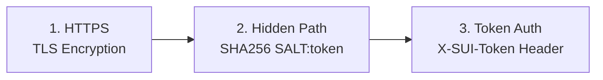

<div align="center">

# 🚀 SUI Solo

**Distributed Proxy Cluster Management System**

[](LICENSE)
[](https://www.docker.com/)
[](https://www.python.org/)

[English](README.md) | [简体中文](README_CN.md)

</div>

---

## 🚀 Quick Start

### Prerequisites

- Docker 20.10+ with Docker Compose
- **Domain name for Master** (required for HTTPS)
- Domain name for each Node
- Ports: 80, 443 (Master & Node), 53 (Node only)

### Install Master

```bash
git clone https://github.com/yourusername/sui-solo.git
cd sui-solo
sudo ./install.sh --master
```

You'll be prompted for:
1. **Master domain** (e.g., `panel.example.com`) - Required for HTTPS!
2. **Email** for SSL certificates

> 📝 **Save the Cluster Secret** displayed after installation!

### Install Node

```bash
sudo ./install.sh --node
# Enter: Cluster Secret, Node Domain, Email
```

### Add Node to Master

Open `https://YOUR_MASTER_DOMAIN` → Click **"+ Add Node"**

---

## 🔒 Security Architecture

### HTTPS Everywhere

```
┌─────────────────────────────────────────────────────────────┐
│                    MASTER (HTTPS Only)                       │
│  ┌─────────────┐      ┌─────────────┐                       │
│  │   Caddy     │ ───▶ │  Flask App  │                       │
│  │  (Gateway)  │      │  (Internal) │                       │
│  │  :80/:443   │      │    :5000    │                       │
│  └─────────────┘      └─────────────┘                       │
└─────────────────────────────────────────────────────────────┘
                              │
                    HTTPS + Token Auth
                              │
┌─────────────────────────────────────────────────────────────┐
│                      NODE (HTTPS Only)                       │
│  ┌─────────────┐      ┌─────────────┐                       │
│  │   Caddy     │ ───▶ │   Agent     │ ───▶ Sing-box        │
│  │  (Gateway)  │      │  (Hidden)   │ ───▶ AdGuard         │
│  └─────────────┘      └─────────────┘                       │
└─────────────────────────────────────────────────────────────┘
```

### Three-Layer Protection



### Salted Path Generation

```python
SALT = "SUI_Solo_Secured_2024"

def get_hidden_path(token: str) -> str:
    combined = f"{SALT}:{token}"
    return hashlib.sha256(combined.encode()).hexdigest()[:16]

# API: /{16-char-hash}/api/v1/status
```

---

## 📁 Project Structure

```
sui-solo/
├── install.sh              # Interactive installer
├── README.md / README_CN.md
├── master/
│   ├── docker-compose.yml  # Caddy + Flask
│   ├── app.py              # Flask backend
│   └── config/caddy/       # Generated Caddyfile
└── node/
    ├── docker-compose.yml  # Caddy + Agent + Services
    ├── agent.py            # Node control API
    └── templates/          # Caddyfile template
```

---

## ⚙️ Configuration

### Master `.env`

```env
CLUSTER_SECRET=<auto-generated>
MASTER_DOMAIN=panel.example.com
ACME_EMAIL=admin@example.com
```

### Node `.env`

```env
CLUSTER_SECRET=<from-master>
NODE_DOMAIN=node1.example.com
PATH_PREFIX=<auto-computed>
ACME_EMAIL=admin@example.com
```

---

## 🔧 Troubleshooting

| Issue | Solution |
|-------|----------|
| SSL error | Ensure DNS points to server, port 80 accessible |
| Token error | Verify secret in `.env` matches Master |
| Port in use | `sudo lsof -i :80` to find conflicting process |

---

## ⚠️ Disclaimer

This project is for **educational purposes only**. Users must comply with local laws. Authors are not responsible for misuse.

---

## 📄 License

MIT License - see [LICENSE](LICENSE)

---

<div align="center">
Made with ❤️ for the open source community
</div>
