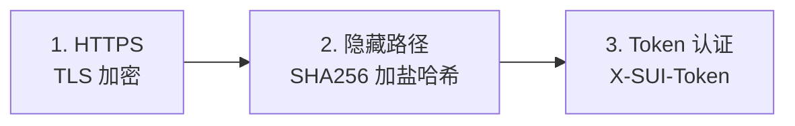

<div align="center">

# 🚀 SUI Solo

**分布式代理集群管理系统**

[](LICENSE)
[](https://www.docker.com/)
[](https://www.python.org/)

[English](README.md) | [简体中文](README_CN.md)

</div>

---

## 🚀 快速开始

### 环境要求

- Docker 20.10+ (含 Docker Compose)
- **Master 必须有域名** (用于 HTTPS 安全)
- 每个 Node 需要域名
- 端口: 80, 443 (Master 和 Node), 53 (仅 Node)

### 安装主控 (Master)

```bash
git clone https://github.com/yourusername/sui-solo.git
cd sui-solo
sudo ./install.sh --master
```

安装时需要输入:
1. **Master 域名** (如 `panel.example.com`) - HTTPS 必需!
2. **邮箱** 用于 SSL 证书

> 📝 **务必保存安装后显示的 Cluster Secret！**

### 安装节点 (Node)

```bash
sudo ./install.sh --node
# 输入: Cluster Secret、节点域名、邮箱
```

### 在主控添加节点

打开 `https://你的主控域名` → 点击 **"+ Add Node"**

---

## 🔒 安全架构

### 全链路 HTTPS

```
┌─────────────────────────────────────────────────────────────┐
│                    主控 MASTER (仅 HTTPS)                    │
│  ┌─────────────┐      ┌─────────────┐                       │
│  │   Caddy     │ ───▶ │  Flask App  │                       │
│  │  (网关)     │      │  (内部)     │                       │
│  │  :80/:443   │      │    :5000    │                       │
│  └─────────────┘      └─────────────┘                       │
└─────────────────────────────────────────────────────────────┘
                              │
                    HTTPS + Token 认证
                              │
┌─────────────────────────────────────────────────────────────┐
│                      节点 NODE (仅 HTTPS)                    │
│  ┌─────────────┐      ┌─────────────┐                       │
│  │   Caddy     │ ───▶ │   Agent     │ ───▶ Sing-box        │
│  │  (网关)     │      │  (隐藏路径) │ ───▶ AdGuard         │
│  └─────────────┘      └─────────────┘                       │
└─────────────────────────────────────────────────────────────┘
```

### 三层防护



### 加盐路径生成

```python
SALT = "SUI_Solo_Secured_2024"

def get_hidden_path(token: str) -> str:
    combined = f"{SALT}:{token}"
    return hashlib.sha256(combined.encode()).hexdigest()[:16]

# API: /{16位哈希}/api/v1/status
```

**设计原理：**
- **确定性**: 相同 Token = 主控和节点计算出相同路径
- **防扫描**: 没有 Token 无法推算 URL
- **纵深防御**: Caddy 仅放行隐藏路径，其他返回伪装页

---

## 📁 项目结构

```
sui-solo/
├── install.sh              # 交互式安装脚本
├── README.md / README_CN.md
├── master/
│   ├── docker-compose.yml  # Caddy + Flask
│   ├── app.py              # Flask 后端
│   └── config/caddy/       # 生成的 Caddyfile
└── node/
    ├── docker-compose.yml  # Caddy + Agent + 服务
    ├── agent.py            # 节点控制 API
    └── templates/          # Caddyfile 模板
```

---

## 🔧 常见问题

| 问题 | 解决方案 |
|------|----------|
| SSL 证书错误 | 确认 DNS 指向服务器，80 端口可访问 |
| Token 错误 | 检查 `.env` 中的密钥是否与 Master 一致 |
| 端口被占用 | `sudo lsof -i :80` 找出占用进程 |

---

## ⚠️ 免责声明

本项目仅供**教育和技术研究目的**。用户必须遵守当地法律法规。作者不对任何滥用行为负责。

---

## 📄 许可证

MIT License - 详见 [LICENSE](LICENSE)

---

<div align="center">
Made with ❤️ for the open source community
</div>
